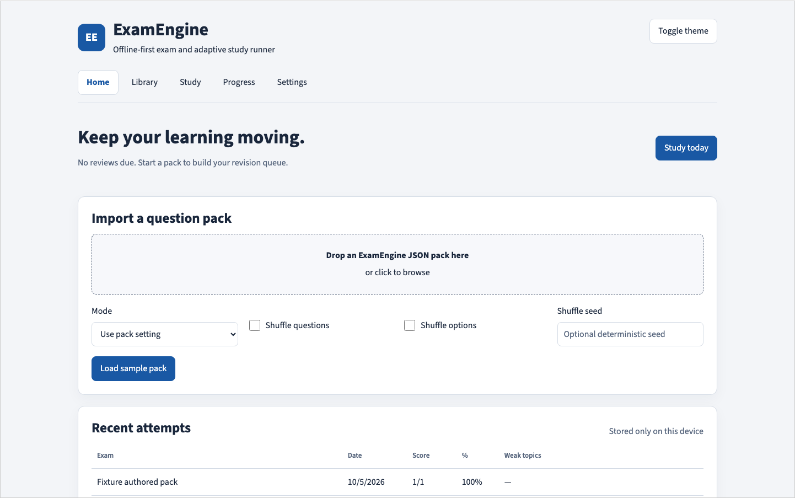

<a id="readme-top"></a>

[![MIT License][license-shield]][license-url]
[![CI][ci-shield]][ci-url]
[![Version][version-shield]][repository-url]
[![JavaScript][javascript-shield]][javascript-url]
[![HTML5][html-shield]][html-url]
[![Node.js][node-shield]][node-url]
[![Python][python-shield]][python-url]

<div align="center">
  <h1>ExamEngine</h1>
  <p>A local-first study workspace for question packs, exams, revision, and portable backups.</p>
  <p>
    <a href="docs/ARCHITECTURE.md">Explore the docs</a>
    · <a href="https://dagerottdev.github.io/ExamEngine/">Open ExamEngine</a>
    · <a href="https://github.com/DagerottDev/ExamEngine/issues">Report a bug</a>
    · <a href="https://github.com/DagerottDev/ExamEngine/issues">Request a feature</a>
  </p>
</div>

<details>
  <summary>Table of Contents</summary>
  <ul>
    <li><a href="#about-the-project">About The Project</a>
      <ul><li><a href="#built-with">Built With</a></li></ul>
    </li>
    <li><a href="#getting-started">Getting Started</a>
      <ul>
        <li><a href="#prerequisites">Prerequisites</a></li>
        <li><a href="#installation">Installation</a></li>
      </ul>
    </li>
    <li><a href="#usage">Usage</a>
      <ul>
        <li><a href="#your-first-exam">Your First Exam</a></li>
        <li><a href="#create-and-validate-a-pack">Create and Validate a Pack</a></li>
        <li><a href="#pack-v2-contract">Pack v2 Contract</a></li>
        <li><a href="#your-study-workspace">Your Study Workspace</a></li>
        <li><a href="#sources-and-question-links">Sources and Question Links</a></li>
        <li><a href="#backups-and-moving-between-devices">Backups and Moving Between Devices</a></li>
      </ul>
    </li>
    <li><a href="#local-data-and-assessment-boundaries">Local Data and Assessment Boundaries</a></li>
    <li><a href="#development">Development</a></li>
    <li><a href="#free-hosting">Free Hosting</a></li>
    <li><a href="#roadmap">Roadmap</a></li>
    <li><a href="#contributing">Contributing</a></li>
    <li><a href="#license">License</a></li>
    <li><a href="#support-the-project">Support the Project</a></li>
    <li><a href="#contact">Contact</a></li>
    <li><a href="#acknowledgments">Acknowledgments</a></li>
  </ul>
</details>

## About The Project

ExamEngine helps learners turn reference material into question packs, take exams offline, and use their results to focus the next study session. It pairs a source-grounded MCQ generator skill with a deterministic browser exam engine.



ExamEngine **2.1** adds eight workspace areas:

- **Appearance and layout:** focused, compact, or spacious presets; timer and palette placement; themes and accents; separate interface/question fonts; reading size, width, and line height; reduced motion; home-card ordering.
- **Portable backups:** full-workspace JSON export, optional password encryption, previewed merge or replace, and one restore recovery snapshot.
- **Pack authoring:** saved drafts, question editing/reordering/duplication, timing and scoring settings, validation, JSON export, and stable pack revisions.
- **Local sources:** text/Markdown, images, and PDFs with question-level file/page/excerpt bindings and a source viewer.
- **Adaptive requests:** configurable topic, count, difficulty, and question-type exports for a separate generation workflow.
- **Custom mocks:** deterministic, topic-balanced selection from saved packs with difficulty/recency filters, timing, and source or uniform scoring.
- **Daily revision:** a due queue using 1/3/7/14/30-day intervals, confidence ratings, mistake reasons, and “still unclear” notes.
- **Progress:** saved detailed attempts, pack/revision/session-context filtering, topic sample counts, score history, matching-question first/retest comparisons, answer-time and confidence summaries, and a wrong-answer notebook.

These extend the existing exam/study flow: single/multiple answers, sections, flags, weighted and negative marks, overall/per-question/combined timers, seeded shuffling, result exports, and legacy pack support. The [verification report](docs/E2E_REPORT.md) records deterministic, native-storage, browser-workflow, and offline checks, with the tested platforms and remaining limits.

The app remains single-user and local-first. There is no account service, automatic cloud sync, instructor backend, proctoring, or in-browser AI generation. The generation skill still runs separately in your own compatible agent.

See [Product](PRODUCT.md), [Design](DESIGN.md), [Architecture](docs/ARCHITECTURE.md), and [Roadmap](docs/ROADMAP.md).

### Built With

- Vanilla JavaScript, HTML, and CSS; deterministic exam/workspace functions.
- Native IndexedDB for workspace data, Web Crypto for encrypted backups, and small `localStorage` appearance/legacy keys.
- [PDF.js](https://github.com/mozilla/pdf.js) for local PDF rendering and text selection.
- [esbuild](https://esbuild.github.io/) for the bundled single-file distribution.
- Python standard library for pack validation; Node's test runner for deterministic/controller tests.
- Bundled Source Sans 3, Lexend, Atkinson Hyperlegible, and Lora fonts, with license notices.
- GitHub Actions for verification, generated artifacts, and Pages deployment.

No backend, API key, or external service is required to use the built viewer. npm dependencies are required to rebuild it.

<p align="right"><a href="#readme-top">Back to top</a></p>

## Getting Started

The repository includes a ready-to-open [offline viewer](mcq-exam-website/index.html) and a [nine-question Cell Biology sample pack](mcq-exam-website/sample-mcq-pack.json). Node.js and Python are needed only for development or CLI validation.

Use [ExamEngine online](https://dagerottdev.github.io/ExamEngine/) or save the
[self-contained HTML](https://dagerottdev.github.io/ExamEngine/index.html) to your
device for offline use. Hosting is free; no login or payment is required.

### Prerequisites

- **Use the viewer:** a modern browser with JavaScript, IndexedDB, Blob/worker support, and Web Crypto. HTTPS or localhost is recommended; storage/crypto behavior for local files varies by browser. See [verified coverage](docs/E2E_REPORT.md).
- **Clone:** Git and access to this repository.
- **Build and test:** Node.js **22.13.0 or newer** with npm, plus Python **3**.
- **Generate questions with the included skill:** an agent environment that supports repository skills, such as Antigravity, and your reference material.

### Installation

1. Clone the repository and enter its directory:

   ```bash
   git clone https://github.com/DagerottDev/ExamEngine.git
   cd ExamEngine
   ```

2. Open `mcq-exam-website/index.html` in your browser. The generated file embeds the styles, JavaScript, and sample pack, so it can run offline without a web server.

The generated viewer includes its runtime code, PDF worker, fonts, styles, and sample. No npm installation, environment variables, API keys, or external services are needed to use that existing file. To regenerate it from source, follow [Development](#development). If you already have the checkout, use its existing directory.

If your browser restricts storage for local files, serve the checkout locally instead:

```bash
python3 -m http.server 8000 --bind 127.0.0.1
```

Then open [the local viewer](http://127.0.0.1:8000/mcq-exam-website/index.html). Keep using the same browser and URL to retain that browser's local history.

<p align="right"><a href="#readme-top">Back to top</a></p>

## Usage

### Your First Exam

1. Open the viewer and leave **Mode** set to **Use pack setting**. Choose shuffle options and an optional seed before loading a pack.
2. Select **Load sample pack** to start the Cell Biology test: nine questions, nine maximum marks, a 15-minute exam limit, and 60 seconds per question. Each wrong answer deducts 0.25 marks.
3. Select answers, move with **Previous**, **Next**, or the question palette, and use **Mark for review** as needed. Multi-select questions require all correct options.
4. Select **Submit exam** and confirm. Review your score, explanations, source references, and topic performance. Topics below 70% of their available marks are identified as weak.
5. Use **Retest wrong answers** for an untimed study session containing wrong and skipped questions, **Export result** to save result JSON, or **Adaptive request options** to choose the next generation request.

To study with immediate feedback, choose **Study** before loading a pack and use **Check answer**. Study mode keeps the pack's timing settings; use `timing.mode: "none"` in a pack for untimed study.

To load your own content, drop a JSON pack onto the upload area or click it to browse. Uploads are limited to **5 MiB**. Valid legacy v1 content is migrated for the session; newly generated packs should use schema v2.

Saved unfinished sessions appear on the landing page with **Resume** and **Discard** controls. The overall exam deadline continues to elapse while the page is closed. Per-question remaining time is preserved across navigation, so revisiting a question does not grant a fresh timer. When the overall timer expires, the exam submits automatically; when a question timer expires, the viewer moves forward or submits at the last question.

Keyboard shortcuts during a session: **← / →** navigate, **F** marks for review, and **A–H** select the corresponding option.

### Create and Validate a Pack

Open the repository in your agent environment and invoke the [mcq-pack-generator skill](.agents/skills/mcq-pack-generator/SKILL.md). Supply the exact question count, source material, and, when available, two to five representative target-exam questions. Include timing and scoring preferences if needed.

The generator skill is open source under the same MIT license as the app.
In Codex, open the repository and invoke `$mcq-pack-generator`; in another
compatible agent, load its `SKILL.md` using that tool's skill mechanism.
To reuse it in another project, copy the **entire**
`.agents/skills/mcq-pack-generator/` directory, including `LICENSE`, `scripts/`,
`resources/`, and `examples/`. For a copy installed elsewhere, validate with
`python3 <skill-folder>/scripts/validate_pack.py <pack.json>`.

Generation runs in your own AI tool, separately from the free website. Any AI
provider charges depend on your tool and account. You can also author packs
manually using the schema; the skill is not required to load a valid JSON pack.
Only publish question packs and reference material you have permission to share.

The skill maps sources, calibrates difficulty, plans coverage, generates questions, and checks grounding, distractors, duplicates, answer-position balance, metadata, and marks consistency before validation. Without a sample paper, it uses moderate difficulty and reports that the difficulty was inferred. Its default output directory is `mcq-packs/`.

Validate any generated or hand-edited pack from the repository root:

```bash
python3 .agents/skills/mcq-pack-generator/scripts/validate_pack.py path/to/pack.json
```

For an adaptive follow-up, open **Adaptive request options** after a session. Choose 1–100 questions, focus topics, difficulty, and single/multi/mixed question type. Export the request, then give it and the relevant reference material to the generator. The request carries pack/attempt context, source references, and question identities to avoid. It does not contain the attached source file bytes or call an AI service. Generate new stems, validate the pack, and import it into the library.

### Pack v2 Contract

Use the [canonical schema](schema/mcq-pack.v2.schema.json) and [complete sample pack](mcq-exam-website/sample-mcq-pack.json) as references. This complete one-question example uses both timers and question-level scoring:

```json
{
  "schemaVersion": "2.0",
  "exam": {
    "title": "Cell Biology Practice",
    "subject": "Biology",
    "examType": "Practice",
    "totalMarks": 1
  },
  "difficulty": "easy",
  "timing": {
    "mode": "both",
    "examDurationSeconds": 300,
    "defaultQuestionSeconds": 60
  },
  "scoring": { "mode": "question" },
  "delivery": {
    "mode": "exam",
    "shuffleQuestions": false,
    "shuffleOptions": false,
    "seed": "cell-practice-01"
  },
  "questions": [
    {
      "id": 1,
      "question": "Ribosomes are composed of which of the following?",
      "options": ["RNA and proteins", "DNA and proteins", "Lipids and RNA", "Only proteins"],
      "answerIndex": 0,
      "marks": 1,
      "negativeMarks": 0.25,
      "explanation": "Ribosomes are nucleoprotein complexes made of rRNA and proteins.",
      "topic": "Cell organelles",
      "difficulty": "easy",
      "cognitiveLevel": "remember",
      "learningObjective": "Recall ribosome composition.",
      "sourceRefs": ["cell-unit:p2"],
      "tags": ["ribosome", "rRNA"],
      "confidence": 0.99
    }
  ]
}
```

- Answer indices are **zero-based**. Single-answer questions use `answerIndex`; multi-select questions use `multiSelect: true` and `answerIndices`, with no `answerIndex`. Multi-select correctness is exact-set and all-or-nothing.
- Timing modes are `none`, `exam`, `question`, and `both`. Per-question limits can override the default with `questionTimeSeconds`.
- Scoring modes are `question` and `uniform`. `exam.totalMarks` must equal the sum of question marks, or `questions.length × scoring.correctMarks` for uniform scoring. Uniform scoring also requires `scoring.negativeMarks`.
- Optional sections use matching section IDs on questions. Learning metadata includes topic, difficulty, cognitive level, learning objective, source references, tags, and confidence.

<p align="right"><a href="#readme-top">Back to top</a></p>

Optional `packId`, per-question `questionUid`, and `sourceBindings` add workspace identity and local file/page/excerpt links without changing schema version 2.0. New ordinary packs do not need those fields; imported content receives identities when saved. Pack JSON does not embed local source files.

### Your Study Workspace

Use **Library** to find packs/questions by text, topic, or difficulty. Imported packs are saved before launch. Choose **Create pack** or **Edit** to change questions, answers, marks, timing, explanations, topics, tags, learning objectives, and sources. Drafts autosave; **Validate and publish** adds a revision. Exact content reimports deduplicate. Stem, option, or correct-answer changes receive a new question identity; cosmetic edits can retain it.

Build a custom mock from selected packs/topics with a count, seed, difficulty, recent-question filter, timer, and scoring rule. Selection fails visibly if too few questions match. Untimed mocks use study delivery. **Study today** and **Study** use due questions from the review queue. Correct confident reviews advance at most once per local day; guesses/unsure answers retain their stage and return tomorrow, while wrong/skipped/still-unclear answers reset to the first interval.

Use **Progress** to filter attempts by pack revision and review scores, topic accuracy/sample counts, timing, confidence, and mistake notes. Legacy history is marked summary-only. Mixed-pack scores are not directly comparable, and small topic samples do not establish mastery.

Under **Settings → Customize appearance**, preview changes before applying them. Place the timer at the header left, header right, or sticky bottom; put the question palette on either side or collapse it. Choose system fonts, Source Sans 3, Lexend, or Atkinson Hyperlegible independently for controls and questions; Lora is also available for question text. Adjust text size, reading width, line height, theme, accent, and motion. Fonts are embedded for offline use, and motion follows your device preference by default.

Home cards support drag ordering and accessible **Move up/Move down** buttons. **Reset layout** and **Reset all appearance** provide separate recovery options. Presentation changes preserve answers, scoring, and timer deadlines.

### Sources and Question Links

1. In **Library → Local source library**, import a supported file.
2. Open a question in the editor. Select the source, optionally enter a PDF page and excerpt/location, and choose **Link source**. Multiple bindings are supported.
3. In study feedback or result review, select the source link to open the local text/image/PDF viewer. PDFs provide page controls, zoom, and a text layer; a download link preserves the original file.

| Input | Limit |
| --- | --- |
| Question-pack JSON | 5 MiB |
| Text or Markdown source | 1 MiB per file; valid UTF-8 |
| PNG, JPEG, or WebP image | 5 MiB per file |
| PDF source | 25 MiB per file |
| All attached sources | 40 MiB total |
| Full backup file | 100 MiB |

File MIME/signatures, sizes, and SHA-256 hashes are checked. `sourceRefs` remain textual/external provenance; `sourceBindings` point to locally attached files. A pack JSON export contains references, not attachment bytes. Use a full backup when sharing a workspace that needs those files. Selecting an external source URL can require a network connection. See tested source/PDF workflows and their limits in [E2E_REPORT](docs/E2E_REPORT.md).

### Backups and Moving Between Devices

**Settings → Data and backups → Download backup** exports packs/revisions, drafts, source file bytes, attempts, review state, notebook, preferences, and any saved session.

Leave both password fields empty for readable JSON. For encryption, enter and confirm a password with at least **12 characters**. Encrypted files use AES-256-GCM with a password-derived key. Passwords are not stored; a forgotten password cannot be recovered. A plain backup contains readable questions, answers, study history, and attachments.

Save the downloaded file to iCloud Drive, Google Drive, another folder, or your own backup system. ExamEngine does not sign in to those providers or synchronize files automatically. On the destination device, open ExamEngine, choose the backup file, enter its password if needed, and inspect the preview:

- **Merge** preserves the current session and local preferences by default. It deduplicates matching records, preserves/remaps conflicts, and rebuilds review state from merged attempts. Tick the preference option to import appearance choices too.
- **Replace** restores the complete backed-up workspace, including preferences and saved session. Complete/discard a current saved session before replacing it.
- **Undo last restore** restores the pre-restore recovery snapshot. Only one snapshot is kept; export a backup before further changes or clearing browser data.

Restoration requires persistent IndexedDB storage. A restored timed session keeps its original deadline; restoring or moving devices does not grant extra time. Actual downloads and offline restore were verified in Chromium; broader browser coverage is tracked in [E2E_REPORT](docs/E2E_REPORT.md). Encryption protects the exported file; the working browser database remains local and unencrypted.

## Local Data and Assessment Boundaries

Workspace data belongs to the browser profile and site origin (scheme, host, and port). Switching browser/profile, changing a localhost port, moving between the hosted demo and a local file, or clearing site data can make the previous workspace unavailable. Private browsing and browser eviction can also remove data. Keep external backups; requesting persistent storage is not a backup.

Legacy v2 `localStorage` resume/history/notebook/theme data migrates once into IndexedDB when available. Originals remain intact; old history lacks detailed answers and becomes summary-only. If persistent storage is unavailable, the app reports temporary mode instead of silently promising saved data.

The app makes no account-backed upload of your local question packs or attempts. Project/support links open the relevant external website. Answers are included in JSON packs and the client; this is a personal-study tool, with no server-side assessment integrity controls. Only use and share source material you have permission to distribute.

<p align="right"><a href="#readme-top">Back to top</a></p>

## Development

Run commands from the repository root with Node.js 22.13.0+ and Python 3. The lockfile pins the build/PDF dependency graph.

```bash
npm ci
npm run verify
npm run build
npm run build:check
# Install the isolated test browser once, then run acceptance checks
npx playwright install chromium --only-shell
npm run test:browser
```

`verify` runs the Node core tests, Python validator tests, and sample-pack validation. `build:check` checks that the committed offline viewer matches the current sources without rewriting it.

After editing source files or the embedded sample, regenerate the distribution:

```bash
npm run build
```

For individual checks, use `npm test`, `npm run test:validator`, or `npm run validate:sample`.

| Path | Purpose |
| --- | --- |
| [`src/core/exam-engine.js`](src/core/exam-engine.js) | Validation, migration, seeded delivery, timing, scoring, and analytics |
| [`src/core/workspace.js`](src/core/workspace.js), [`src/core/backup.js`](src/core/backup.js) | IndexedDB, identity, mocks/reviews, validated backups and restore |
| [`src/app.js`](src/app.js), [`src/workspace-ui.js`](src/workspace-ui.js) | Session controller, workspace views, editor, sources, preferences, and exports |
| [`src/index.html`](src/index.html), [`src/styles.css`](src/styles.css) | Development shell and styles |
| [`scripts/build.mjs`](scripts/build.mjs) | Combines source and sample into the offline HTML file |
| [`mcq-exam-website/`](mcq-exam-website/) | Generated viewer and sample pack |
| [`schema/`](schema/) | Canonical v2 JSON Schema |
| [`.agents/skills/mcq-pack-generator/`](.agents/skills/mcq-pack-generator/) | Generator workflow, schema copy, examples, and Python validator |
| [`tests/`](tests/) | Core and validator tests |
| [`docs/`](docs/) | Architecture, dated project status, and roadmap |

Edit the modular files in `src/`, then build; direct changes to the generated viewer will be overwritten. Serve and test the generated [local viewer](http://127.0.0.1:8000/mcq-exam-website/index.html). The raw `src/index.html` has bare package imports and is not the standalone browser entry point. `build:check` verifies artifact consistency; it does not exercise the browser.

Existing Codex skills used for this implementation include Ponytail, Impeccable, UI UX Pro Max, Playwright, and repo-readme. They are development guidance, not viewer dependencies; no additional skill installation is required. The included `mcq-pack-generator` remains the separate, optional generation workflow.

The [CI workflow](.github/workflows/ci.yml) runs core tests, validator tests, sample validation, deterministic build checks, and isolated Chromium storage/workflow/offline acceptance on pull requests and pushes to `main` or `goal/**`. On successful push runs, it commits and pushes the regenerated viewer if the output changed. Deterministic/controller tests do not replace browser coverage. Browser screenshots and reports are uploaded as CI artifacts. Current browser evidence and remaining platform checks are tracked in [E2E_REPORT](docs/E2E_REPORT.md).

After verification, pushes to `main` also deploy the built viewer to GitHub Pages.
Pull requests and `goal/**` branches do not deploy. A manual workflow run on
`main` can redeploy the current version.

<p align="right"><a href="#readme-top">Back to top</a></p>

## Free Hosting

ExamEngine uses static GitHub Pages hosting at
[dagerottdev.github.io/ExamEngine](https://dagerottdev.github.io/ExamEngine/).
The app needs no server, database, or paid hosting subscription.

To host your own fork:

1. Create a public repository on GitHub. GitHub Pages supports public repositories
   on GitHub Free.
2. Open **Settings → Pages → Build and deployment → Source** and select
   **GitHub Actions**.
3. Push a change to `main`, or run **Actions → ExamEngine CI → Run workflow**
   on `main`. Tests and validation must pass before deployment.
4. Find your site URL in **Settings → Pages** or the workflow's `github-pages`
   deployment. A project site normally uses `https://<owner>.github.io/<repo>/`.
5. Update this README and the source/support links for your fork, retaining the
   MIT notices. Run `npm run build` after changing source files.

CI publishes only `mcq-exam-website/`, including the viewer, sample JSON, and a
license copy. The generator is shared through the source repository and runs in
users' own AI tools.

Use the supplied `github.io` address to keep hosting at **₹0**. A purchased
domain, AI generation, and payment-provider fees are separate optional costs.
GitHub Pages has usage limits and is not intended for paid SaaS or sites primarily
focused on commercial transactions; this app stays free with optional external
support links. See [GitHub Pages availability](https://docs.github.com/en/pages/getting-started-with-github-pages/what-is-github-pages)
and [usage limits](https://docs.github.com/en/pages/getting-started-with-github-pages/github-pages-limits).

<p align="right"><a href="#readme-top">Back to top</a></p>

## Roadmap

The [roadmap](docs/ROADMAP.md) preserves the complete eight-area study-workspace scope and its acceptance gates, then tracks deeper learning, content-management, release, and optional hosted/instructor work. Source implementation, verified behavior, and planned extensions are recorded separately.

<p align="right"><a href="#readme-top">Back to top</a></p>

## Contributing

Discuss bugs and proposed changes through [repository issues][issues-url] or a pull request. Include the pack, reproduction steps, and browser details for exam-workflow problems. Run `npm run verify` and `npm run build:check` before submitting changes; regenerate the viewer when source or sample content changes.

<p align="right"><a href="#readme-top">Back to top</a></p>

## License

Distributed under the [MIT License](LICENSE). This covers the app, documentation,
schemas, and author-owned generator skill and examples. The skill includes its
own license copy, and the generated HTML embeds the full notice for offline reuse.
PDF.js retains its Apache-2.0 license; bundled fonts retain their SIL Open Font License notices in [`src/assets/fonts/`](src/assets/fonts/). The build embeds PDF.js/font notices with the MIT notice. Third-party source books, papers, and user-supplied material retain their own rights.

<p align="right"><a href="#readme-top">Back to top</a></p>

## Support the Project

ExamEngine is free to use. If it helps your study sessions, you can support its
development:

- [Buy me a coffee](https://buymeacoffee.com/dagerottdev) — international support.
- [Buy me a chai on Bondin](https://bondin.io/dagerottdev) — support from India.

Support is optional. Payments are handled on the providers' websites; their fees
and terms apply. Bug reports, contributions, and documentation improvements are
welcome too.

<p align="right"><a href="#readme-top">Back to top</a></p>

## Contact

Use the [ExamEngine repository][repository-url] and [issue tracker][issues-url] for project support.

<p align="right"><a href="#readme-top">Back to top</a></p>

## Acknowledgments

- The included biology sample pack credits *NCERT Biology — Class XI*, “Cell: The Unit of Life,” as its source material.
- README layout inspired by [Best-README-Template](https://github.com/othneildrew/Best-README-Template).

<p align="right"><a href="#readme-top">Back to top</a></p>

[repository-url]: https://github.com/DagerottDev/ExamEngine
[issues-url]: https://github.com/DagerottDev/ExamEngine/issues
[javascript-shield]: https://img.shields.io/badge/JavaScript-F7DF1E?style=for-the-badge&logo=javascript&logoColor=black
[javascript-url]: https://developer.mozilla.org/en-US/docs/Web/JavaScript
[html-shield]: https://img.shields.io/badge/HTML5-E34F26?style=for-the-badge&logo=html5&logoColor=white
[html-url]: https://developer.mozilla.org/en-US/docs/Web/HTML
[node-shield]: https://img.shields.io/badge/Node.js-22.13%2B-339933?style=for-the-badge&logo=nodedotjs&logoColor=white
[node-url]: https://nodejs.org/
[python-shield]: https://img.shields.io/badge/Python-3-3776AB?style=for-the-badge&logo=python&logoColor=white
[python-url]: https://www.python.org/

[license-shield]: https://img.shields.io/github/license/DagerottDev/ExamEngine?style=for-the-badge
[license-url]: LICENSE
[ci-shield]: https://img.shields.io/github/actions/workflow/status/DagerottDev/ExamEngine/ci.yml?branch=main&style=for-the-badge&label=CI
[ci-url]: https://github.com/DagerottDev/ExamEngine/actions/workflows/ci.yml
[version-shield]: https://img.shields.io/badge/version-2.1.0-1958a4?style=for-the-badge
